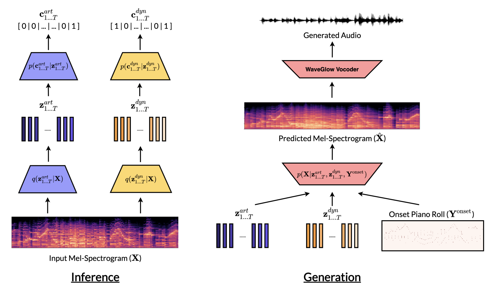

# Generative Modelling for Controllable Audio Synthesis of Piano Performance

This repository contains code for the paper ["Generative Modelling for Controllable Audio Synthesis of Piano Performance"](https://arxiv.org/pdf/2006.09833.pdf) by Hao Hao Tan, Yin-Jyun Luo and Dorien Herremans.  

We utilize [Gaussian Mixture VAEs](https://arxiv.org/pdf/1611.05148.pdf) in neural audio synthesis models to allow temporal conditioning of two essential style features for piano performances: *articulation* and *dynamics*.



## Train model
1. Download the [MAESTRO v2.0.0](https://magenta.tensorflow.org/datasets/maestro) dataset.
2. Modify the training configurations in `nms_latent_config.json`.
3. Run `python trainer_nms_latent_dynamic.py`.
4. The trained model weights and logs can be found in `params/` and `logs/` folder respectively.

After training completes, follow `visualize.ipynb` to observe the controllable generation of spectrograms under different degrees of articulation / dynamics.

## Resources
- [arXiv paper](https://arxiv.org/pdf/2006.09833.pdf)
- [Demo website](https://piano-performance-synthesis.github.io/)

## Citation

This research work is published at the ICML ML4MD Workshop, 2020.

```
@inproceedings{tan20generative,
  author = {Tan, Hao Hao and Luo, Yin-Jyun and Herremans, Dorien},
  booktitle = {ICML Workshop on Machine Learning for Music Discovery Workshop (ML4MD), Extended Abstract},
  title = {Generative Modelling for Controllable Audio Synthesis of Piano Performance},
  year = {2020}
}
```
